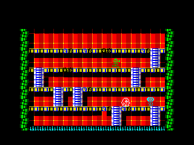
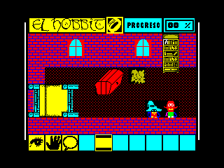
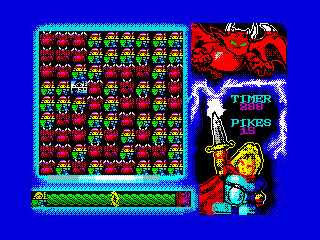

[](https://github.com/boriel/zxbasic/actions)
[](./LICENSE.txt)
[](https://pypi.python.org/pypi/zxbasic)

ZX BASIC
--------

Copyleft (K) 2008, Jose Rodriguez-Rosa (a.k.a. Boriel) <http://www.boriel.com>

All files in this project are covered under the [GPLv3 LICENSE](http://www.gnu.org/licenses/gpl.html)
except those placed in directories `library/` and `library-asm`.
Those are licensed under [MIT license](https://en.wikipedia.org/wiki/MIT_License) unless otherwise
specified in the files themselves (i.e. a different license). Anyway, all of
the licenses for files under those directories allow binary closed-source
(i.e. commercial) distribution of the files created with this compiler.

You can create closed-source programs (even commercial ones) with this compiler
(a mention to this tool will be welcome, though). But you are not allowed to
release the compiler itself as a closed source program.

If you modify *this* project (the compiler .py or anything licensed as GPLv3)
in any way you MUST publish the changes you made and submit your contribution
to the community under the same license.

-------------------------

DOCUMENTATION
-------------

This is a very little help file.

 - For DOCUMENTATION in English go to the [ZX BASIC docs](https://zxbasic.readthedocs.io/en/latest/).

 - For help, support, updates meet the community at the [forum](https://www.boriel.com/forum).


INSTALLATION
------------

Go to the [ZXBasic download page](https://zxbasic.readthedocs.io/en/latest/archive/)
and get the version most suitable for you.

There are, basically, two flavors (both with identical capabilities):

 - For Windows you can download de win32 executable (Windows .exe zip package) version.
To install just uncompress it in a directory of your choice.
The main executable is `zxbc.exe` (more on this later). With this toolchain
also comes `zxbasm.exe` (the assembler) and `zxbpp.exe` (the preprocessor), but these
are not needed when programming in BASIC.

 - For Linux and Mac OSX there is a python version, so you will need a python
interpreter (available on many platforms, and usually already installed in Linux and Mac OSX).
Just uncompress it in a directory of your choice and installation is done. :-)
The main executables are `zxbc.py` (the compiler), `zxbasm.py` (the assembler) and `zxbpp.py` (the preprocessor).
You can use this version in Windows, but will need to install a python interpreter first.

##### Examples


||||
|---|---|---|
| An in-game screenshot of Eleuterio by @*na_th_an* | Ingame screenshot of _El Hobbit_ by @*Wilco2000*| Ingame screenshot of _Knignt and Demonds DX_ by Einar Saukas

See more examples at the [Relased Programs](https://zxbasic.readthedocs.io/en/latest/released_programs/) page.

QUICK START
-----------

For a quick start, just open a terminal in your PC in the same directory you uncompressed ZX Basic
and type `zxbc` (on Windows) or `zxbc.py` (OSX, Linux). You should see a zxbasic message like this:

```
usage: zxbc [-h] [-d] [-O OPTIMIZE] [-o OUTPUT_FILE] [-T] [-t] [-B] [-a] [-A]
           [-S ORG] [-e STDERR] [--array-base ARRAY_BASE]
           [--string-base STRING_BASE] [-Z] [-H HEAP_SIZE] [--debug-memory]
           [--debug-array] [--strict-bool] [--enable-break] [-E] [--explicit]
           [-D DEFINES] [-M MEMORY_MAP] [-i] [-I INCLUDE_PATH] [--strict]
           [--version]
           PROGRAM
zxbc: error: the following arguments are required: PROGRAM
```

Create a text file with the following content:

~~~~
10 CLS
20 PRINT "HELLO WORLD!"
~~~~

Save it as `hello.bas` and finally compile it with:
~~~~
zxbc -taB hello.bas
~~~~

If everything went well, a file named `hello.tap` should be created.
Open it with your favourite emulator (i.e. fuse) and see the result.

Congratulations! You're now ready to create compiled BASIC programs for
your machine. Check and compile the examples included in the examples/ folder
or go to the [documentation page](https://zxbasic.readthedocs.io/en/latest/) for further info.

ACKNOWLEDGEMENTS
---------------

These are some people who has contributed in a way or another. I consider
some of them co-authors (Britlion, LCD, em00k, ...) of this project.

Also, many thanks to people supporting this project with their donations!

------
[](https://ko-fi.com/boriel)
