# Released Programs

This is a list of third-party ZX-Spectrum programs (mostly games) developed with ZX BASIC. Some of them also provide full source code, so they can be used as reference about how to create new programs.

A similar list is also available at [https://spectrumcomputing.co.uk/index.php?cat=999&group_id=4007](https://spectrumcomputing.co.uk/index.php?cat=999&group_id=4007)

---
## PLAYABLE GAMES

### 3 Reyes Magos

Author: J.B.G.V.

Type: Arcade Game

Year: 2012

Source: Yes

Link: [https://spectrumcomputing.co.uk/index.php?cat=96&id=27998](https://spectrumcomputing.co.uk/index.php?cat=96&id=27998)

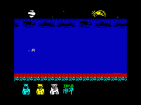

---
### A Broken Friend

Author: Paul Jenkinson

Type: Text Adventure Game

Year: 2012

Source: No

Link: [https://spectrumcomputing.co.uk/index.php?cat=96&id=27296](https://spectrumcomputing.co.uk/index.php?cat=96&id=27296)

---
### Abydos

Author: J.B.G.V.

Type: Platform Game

Year: 2013

Source: Yes

Link: [https://spectrumcomputing.co.uk/index.php?cat=96&id=28165](https://spectrumcomputing.co.uk/index.php?cat=96&id=28165)

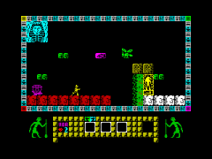

---
### AD LUNAM

Author: [Alessandro Grussu](https://www.alessandrogrussu.it/profilo.html)

Type: Simulation / Management

Year: 2019

Source: Yes

Link: [https://www.alessandrogrussu.it/Adlunam.html](https://www.alessandrogrussu.it/Adlunam.html)

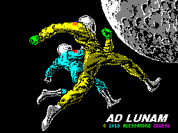

---
### AD LUNAM PLUS

Author: [Alessandro Grussu](https://www.alessandrogrussu.it/profilo.html)

Type: Simulation / Management

Year: 2020

Source: Yes

Link: [https://www.alessandrogrussu.it/ALP.html](https://www.alessandrogrussu.it/ALP.html)

---
### Bacaball

Author: Paulo Silva

Type: Sport Game

Year: 2011

Source: Yes

Link: [http://www.mojontwins.com/csscgc2011/nitrofurano-bacaball/](http://www.mojontwins.com/csscgc2011/nitrofurano-bacaball/)

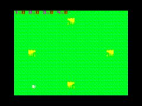

---
### Bacachase

Author: Paulo Silva

Type: Puzzle Game

Year: 2011

Source: Yes

Link: [http://www.mojontwins.com/csscgc2011/nitrofurano-bacachase/](http://www.mojontwins.com/csscgc2011/nitrofurano-bacachase/)

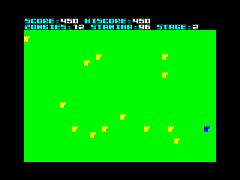

---
### BerksMan

Author: Paul Fisher

Type: Arcade Game

Year: 2012

Source: Yes

Link: [https://spectrumcomputing.co.uk/index.php?cat=96&id=27713](https://spectrumcomputing.co.uk/index.php?cat=96&id=27713)

Programming tutorial discussing how this was made: [Link](http://goo.gl/4jPd5)

---
### Binary Land

Author: [Joflof](https://www.joflof.com)

Type: Arcade Game

Year: 2020

Source: Yes

Link: [https://www.joflof.com/binary.html](https://www.joflof.com/binary.html)

---
### Bounty - The Search for Frooge

Author: Paul Jenkinson

Type: Text Adventure Game

Year: 2012

Source: No

Link: [https://spectrumcomputing.co.uk/index.php?cat=96&id=27876](https://spectrumcomputing.co.uk/index.php?cat=96&id=27876)

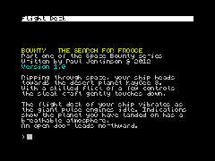

---
### Chessboard Attack

Authors: Leszek Chmielewski Daniel (LCD), Kriss

Type: Board Game

Year: 2011

Source: Yes

Link: [https://spectrumcomputing.co.uk/index.php?cat=96&id=26121](https://spectrumcomputing.co.uk/index.php?cat=96&id=26121)

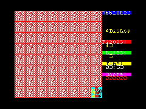

---
### Ciclopes (y Saturno)

Authors: Apenao

Type: Sports

Year: 2013

Source: Yes

Link: [https://spectrumcomputing.co.uk/index.php?cat=96&id=30024](https://spectrumcomputing.co.uk/index.php?cat=96&id=30024)

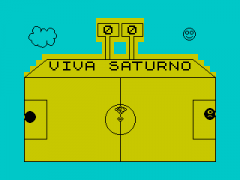

---
### Coches

Authors: Apenao

Type: Racing

Year: 2013

Source: Yes

Link: [https://spectrumcomputing.co.uk/index.php?cat=96&id=30025](https://spectrumcomputing.co.uk/index.php?cat=96&id=30025)

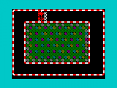

---
### Cuadragon

Author: [Duefectu](http://duefectucorp.com/)

Type: Adventure Game

Year: 2020

Source: No

Link: [http://duefectucorp.com/Productos/Cuadragon](http://duefectucorp.com/Productos/Cuadragon)

---
### Dex

Author: Lee Tonks

Type: Arcade Game

Year: 2011

Source: No

Link: [https://spectrumcomputing.co.uk/index.php?cat=96&id=26574](https://spectrumcomputing.co.uk/index.php?cat=96&id=26574)

---
### Earthraid

Authors: Leszek Chmielewski Daniel (LCD)

Type: Strategy Game

Year: 2012

Source: No

Link: [https://spectrumcomputing.co.uk/index.php?cat=96&id=27687](https://spectrumcomputing.co.uk/index.php?cat=96&id=27687)

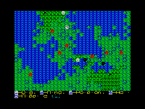

---
### El Hobbit

Author: J.B.G.V.

Type: Arcade (Platform)

Year: 2012

Source: No

Link: [https://spectrumcomputing.co.uk/index.php?cat=96&id=27993](https://spectrumcomputing.co.uk/index.php?cat=96&id=27993)

---
### El Hobbit

Author: Alejandro Valero

Type: Graphic Adventure

Year: 2012

Source: No

Link: [https://spectrumcomputing.co.uk/index.php?cat=96&id=27992](https://spectrumcomputing.co.uk/index.php?cat=96&id=27992)

---
### Eleuterio, el Mono Serio (demo)

Author: na_th_an (The Mojon Twins)

Type: Arcade (Platform)

Year: 2012

Source: Yes

Link: [https://spectrumcomputing.co.uk/index.php?cat=96&id=27307](https://spectrumcomputing.co.uk/index.php?cat=96&id=27307)

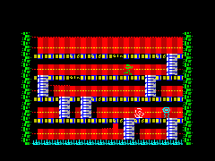

---
### Encuerer

Author: na_th_an (LOKOsoft)

Type: Arcade (Platform)

Year: 2013

Source: Yes

Link: [http://www.csscgc2013.blogspot.com.es/2013/02/encuerer.html](http://www.csscgc2013.blogspot.com.es/2013/02/encuerer.html)

---
### Escape from Cnossus

Author: Felix Plesoianu

Type: Dungeon Game

Year: 2013

Source: Yes

Link: [http://notimetoplay.org/our-games/escape-from-cnossus/](http://notimetoplay.org/our-games/escape-from-cnossus/)

---
### Explorer

Author: Luca bordoni

Type: Arcade Game / Shoot-em-up

Year: 2015

Source: No

Link: [https://spectrumcomputing.co.uk/index.php?cat=96&id=30212](https://spectrumcomputing.co.uk/index.php?cat=96&id=30212)

---
### H7N9

Author: Paulo Silva

Type: Platform

Year: 2015

Source: Yes

Link: [http://nitrofurano.itch.io/h5n1](http://nitrofurano.itch.io/h5n1)

---
### He had such a big head that if he were a cat he would have to toss the mice from under the bed with a brow

Author: The Mojon Twins

Type: Arcade (Platform)

Year: 2010

Source: Yes

Link: [http://www.mojontwins.com/2010/05/04/mojontwins-en-la-csscgc-2010/](http://www.mojontwins.com/2010/05/04/mojontwins-en-la-csscgc-2010/)

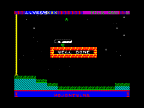

---
### Hunt the Wumpus

Author: Leszek Chmielewski Daniel (LCD)

Type: Maze Game

Year: 2013

Source: No

Link: [https://spectrumcomputing.co.uk/index.php?cat=96&id=28119](https://spectrumcomputing.co.uk/index.php?cat=96&id=28119)

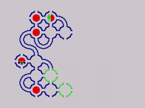

---
### Knights & Demons DX

Authors: Manuel Gomez, Einar Saukas, Craig Stevenson

Type: Puzzle Game

Year: 2013

Source: Yes

Link: [https://spectrumcomputing.co.uk/index.php?cat=96&id=28175](https://spectrumcomputing.co.uk/index.php?cat=96&id=28175)

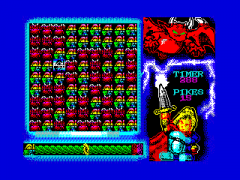

---
### Lamega

Author: rikokun

Type: Shooter

Year: 2016

Source: no

Link: [https://spectrumcomputing.co.uk/index.php?cat=96&id=30284](https://spectrumcomputing.co.uk/index.php?cat=96&id=30284)

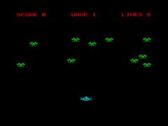

---
### Looking for a csscgc2012 theme

Author: Paulo Silva

Type: Adventure Game

Year: 2012

Source: Yes

Link: [https://www.yoursinclair.co.uk/csscgc/csscgc.cgi?search=0301180542lookingforacsscgc2012theme_20120301145340.zip](https://www.yoursinclair.co.uk/csscgc/csscgc.cgi?search=0301180542lookingforacsscgc2012theme_20120301145340.zip)

Description: optimized for ULA-Plus palette

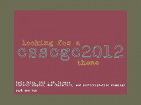

---
### Maritrini, Freelance Monster Slayer en: Las Increibles Vicisitudes de Despertarse Resacosa con Fred en la Cama y Tener que Llegar Mas o Menos Puntual a la Prueba de "Monstruos Vigorosos de Pechos Lustrosos" featuring Los Fratelli

Author: The Mojon Twins

Type: Arcade Game

Year: 2012

Source: Yes

Link: [https://spectrumcomputing.co.uk/index.php?cat=96&id=27953](https://spectrumcomputing.co.uk/index.php?cat=96&id=27953)

---
### Memorama

Author: Paulo Silva

Type: Puzzle Game

Year: 2011

Source: Yes

Link: [http://www.mojontwins.com/csscgc2011/paulo-silva-memorama/](http://www.mojontwins.com/csscgc2011/paulo-silva-memorama/)

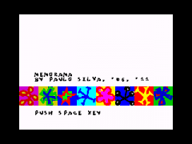

---
### O-CMAN

Author: oblo

Type: Arcade Game

Year: 2011

Source: Yes

Link: [https://spectrumcomputing.co.uk/index.php?cat=96&id=26598](https://spectrumcomputing.co.uk/index.php?cat=96&id=26598)

---
### O-TRIX

Author: oblo

Type: Puzzle Game

Year: 2011

Source: Yes

Link: [https://spectrumcomputing.co.uk/index.php?cat=96&id=26573](https://spectrumcomputing.co.uk/index.php?cat=96&id=26573)

---
### Pets vs Aliens Prologue

Authors: Einar Saukas, Jarrod Bentley, Yerzmyey

Type: Puzzle Game

Year: 2015

Source: No

Link: [https://spectrumcomputing.co.uk/index.php?cat=96&id=30197](https://spectrumcomputing.co.uk/index.php?cat=96&id=30197)

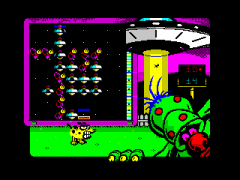

---
### Pixel Quest

Author: Einar Saukas, MmcM, Craig Stevenson

Type: Puzzle

Year: 2015

Source: Yes

Link: [https://spectrumcomputing.co.uk/index.php?cat=96&id=30237](https://spectrumcomputing.co.uk/index.php?cat=96&id=30237)

---
### Pixel Quest 2000

Author: Einar Saukas, MmcM, PheeL

Type: Puzzle

Year: 2017

Source: Yes

Link: [https://spectrumcomputing.co.uk/index.php?cat=96&id=31490](https://spectrumcomputing.co.uk/index.php?cat=96&id=31490)

---
### Pixel Quest Zero

Author: Einar Saukas, MmcM, PheeL

Type: Puzzle

Year: 2018

Source: Yes

Link: [https://spectrumcomputing.co.uk/index.php?cat=96&id=34291](https://spectrumcomputing.co.uk/index.php?cat=96&id=34291)

---
### Quest for Witchcraft

Authors: Leszek Chmielewski Daniel (LCD), Mister Beep

Type: Puzzle Game

Year: 2011

Source: No

Link: [https://spectrumcomputing.co.uk/index.php?cat=96&id=27261](https://spectrumcomputing.co.uk/index.php?cat=96&id=27261)

---
### Ratul & Zeki

Author: Salvacam (Spain)

Type: Arcade (Platform)

Year: 2011

Source: Yes

Link: [https://spectrumcomputing.co.uk/index.php?cat=96&id=27055](https://spectrumcomputing.co.uk/index.php?cat=96&id=27055)

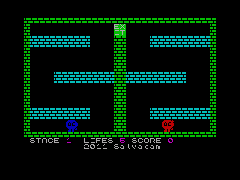

---
### Retrobsesion

Author: J.B.G.V.

Type: Arcade Game

Year: 2011

Source: Yes

Link: [https://spectrumcomputing.co.uk/index.php?cat=96&id=26193](https://spectrumcomputing.co.uk/index.php?cat=96&id=26193)

---
### Retrobsesion II

Author: J.B.G.V.

Type: Arcade Game

Year: 2012

Source: Yes

Link: [https://spectrumcomputing.co.uk/index.php?cat=96&id=27389](https://spectrumcomputing.co.uk/index.php?cat=96&id=27389)

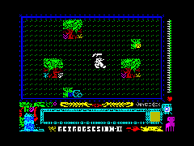

---
### Saltarin

Author: Salvacam (Spain)

Type: Arcade (Platform)

Year: 2011

Source: Yes

Link: [https://spectrumcomputing.co.uk/index.php?cat=96&id=27160](https://spectrumcomputing.co.uk/index.php?cat=96&id=27160)

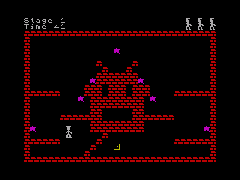

---
### Solitario

Author: Paulo Silva

Type: Puzzle Game

Year: 2011

Source: Yes

Link: [http://www.mojontwins.com/csscgc2011/nitrofurano-solitario/](http://www.mojontwins.com/csscgc2011/nitrofurano-solitario/)

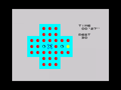

---
### Souls

Author: Alxinho

Type: Platform Game

Year: 2013

Source: Yes

Link: [https://spectrumcomputing.co.uk/index.php?cat=96&id=28172](https://spectrumcomputing.co.uk/index.php?cat=96&id=28172)

---
### SpeccyWars

Author: Slenkar

Type: Strategy Game

Year: 2013

Source: Yes

Link: [http://www.boriel.com/forum/post4467.html#p4467](http://www.boriel.com/forum/post4467.html#p4467)

---
### Stela

Author: J.B.G.V.

Type: Arcade Game

Year: 2011

Source: Yes

Link: [https://spectrumcomputing.co.uk/index.php?cat=96&id=26527](https://spectrumcomputing.co.uk/index.php?cat=96&id=26527)

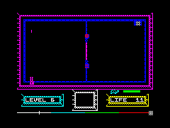

---
### Steroids Sports Diving: Splash

Author: apenao

Type: Sports Game

Year: 2012

Source: No

Link: [http://cgc.zx.gen.tr/index.php?game=0628182038](http://cgc.zx.gen.tr/index.php?game=0628182038)

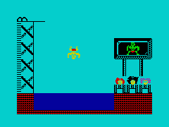

---
### The Spectral Dungeons

Author: Felix Plesoianu

Type: Dungeon Game

Year: 2013

Source: Yes

Link: [https://spectrumcomputing.co.uk/index.php?cat=96&id=28173](https://spectrumcomputing.co.uk/index.php?cat=96&id=28173)

---
### The Tales of Grupp

Author: Alxinho

Type: ?

Year: 2015

Source: Yes

Link: [http://retrobytesproductions.blogspot.com.es/2015/02/the-tales-of-grupp.html](http://retrobytesproductions.blogspot.com.es/2015/02/the-tales-of-grupp.html)

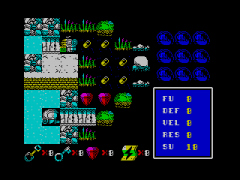

---
### U-Boot Hunt

Author: Leszek Chmielewski Daniel (LCD)

Type: Puzzle Game

Year: 2012

Source: No

Link: [https://spectrumcomputing.co.uk/index.php?cat=96&id=27688](https://spectrumcomputing.co.uk/index.php?cat=96&id=27688)

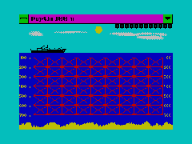

---
### Uchi-Danza

Author: J.B.G.V.

Type: Action Game

Year: 2011

Source: No

Link: [http://www.mojontwins.com/csscgc2011/jbgv-uchi-danza/](http://www.mojontwins.com/csscgc2011/jbgv-uchi-danza/)

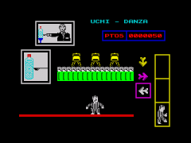

---
### VADE RETRO

Author: J.B.G.V.

Type: Action Game

Year: 2012

Source: Yes

Link: [https://spectrumcomputing.co.uk/index.php?cat=96&id=27878](https://spectrumcomputing.co.uk/index.php?cat=96&id=27878)

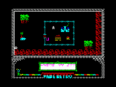

---
### Vampe: GOTO Vampe

Author: Valdir

Type: Maze Game

Year: 2013

Source: No

Link: [https://spectrumcomputing.co.uk/index.php?cat=96&id=28168](https://spectrumcomputing.co.uk/index.php?cat=96&id=28168)

---
### Walking around Porto

Author: Paulo Silva

Type: ?

Year: 2013

Source: Yes

Link: [http://csscgc2013.blogspot.pt/2013/06/walking-around-porto.html](http://csscgc2013.blogspot.pt/2013/06/walking-around-porto.html)

Description: a tour in Porto (or Oporto) city - runs on a 128kb ZX-Spectrum, on a b&w display

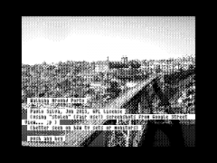

---
### Yumiko in the haunted Mansion

Author: Leszek Chmielewski Daniel (LCD)

Type: Action Game

Year: 2012

Source: No

Link: [https://spectrumcomputing.co.uk/index.php?cat=96&id=27988](https://spectrumcomputing.co.uk/index.php?cat=96&id=27988)

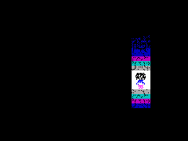

---
### ZEN

Author: Einar Saukas, Mister Beep

Type: Puzzle

Year: 2014

Source: Yes

Link: [https://spectrumcomputing.co.uk/index.php?cat=96&id=30157](https://spectrumcomputing.co.uk/index.php?cat=96&id=30157)

---
### ZEN II

Author: Einar Saukas, Mister Beep

Type: Puzzle

Year: 2015

Source: Yes

Link: [https://spectrumcomputing.co.uk/index.php?cat=96&id=30208](https://spectrumcomputing.co.uk/index.php?cat=96&id=30208)

---
### ZX Connection

Author: [Antonio Silva](https://avlixa.itch.io/)

Type: Arcade Game

Year: 2020

Source: Yes

Link: [https://avlixa.itch.io/zx-connection](https://avlixa.itch.io/zx-connection)

---
### ZX Destroyer

Author: Alxinho

Type: Shooter

Year: 2014

Source: Yes

Link: [http://retrobytesproductions.blogspot.com.es/2014/03/zx-destroyer.html](http://retrobytesproductions.blogspot.com.es/2014/03/zx-destroyer.html)

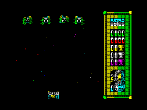

---
### ZX Striker

Author: Valdir

Type: Sports Game

Year: 2013

Source: No

Link: [https://spectrumcomputing.co.uk/index.php?cat=96&id=28170](https://spectrumcomputing.co.uk/index.php?cat=96&id=28170)

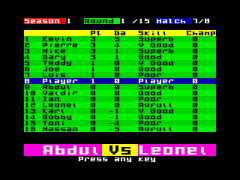

---
## DEMOS

### EMS Christmas Card Demo

Author: Eqx

Type: 

Year: 2016

Source: No

Link: [http://www.boriel.com/forum/gallery/ems-christmas-card-demo-t1102.html](http://www.boriel.com/forum/gallery/ems-christmas-card-demo-t1102.html)

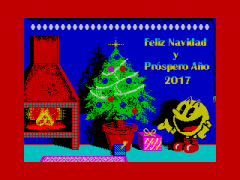

---
### JRPG Test

Author: rikokun

Type:

Year: 2016

Source: No

Link: [http://www.boriel.com/forum/gallery/jrpg-test-and-tileeditor-t1082.html](http://www.boriel.com/forum/gallery/jrpg-test-and-tileeditor-t1082.html)

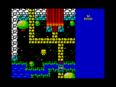

---
### Just Something Silly

Author: emook

Type: Demo

Year: 2016

Source: No

Link: [http://www.boriel.com/forum/gallery/just-something-silly-t1095.html](http://www.boriel.com/forum/gallery/just-something-silly-t1095.html)

Description:

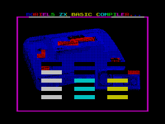

---
### Nothing Thing

Author: Paulo Silva

Type: Demo

Year: 2013

Source: Yes

Link: [http://csscgc2013.blogspot.pt/2013/03/nothing-thing.html](http://csscgc2013.blogspot.pt/2013/03/nothing-thing.html)

Description: optimized for ULA-Plus palette, it will look weird on common ZX-Spectrum machines.

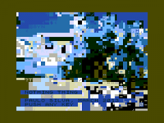

---
## GAME ENGINES

### BIFROST* ENGINE

Authors: Einar Saukas, Dave Hughes

Type: Multicolor Engine

Year: 2012

Source: Yes

Link: [https://spectrumcomputing.co.uk/index.php?cat=96&id=27405](https://spectrumcomputing.co.uk/index.php?cat=96&id=27405)

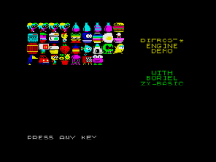

---
### BIFROST*2 ENGINE

Author: Einar Saukas

Type: Multicolor Engine

Year: 2016

Source: Yes

Link: [https://spectrumcomputing.co.uk/index.php?cat=96&id=30003](https://spectrumcomputing.co.uk/index.php?cat=96&id=30003)

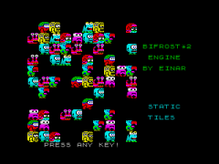

---
### Fourspriter Engine

Author: The Mojon Twins

Type: Sprite Engine

Year: 2010

Source: Yes

Link: [http://www.mojontwins.com/juegos_mojonos/fourspriter-1-0/](http://www.mojontwins.com/juegos_mojonos/fourspriter-1-0/)

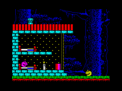

---
### NIRVANA ENGINE

Author: Einar Saukas

Type: Bicolor Engine

Year: 2013

Source: Yes

Link: [https://spectrumcomputing.co.uk/index.php?cat=96&id=30001](https://spectrumcomputing.co.uk/index.php?cat=96&id=30001)

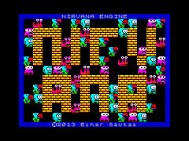

---
### NIRVANA+ ENGINE

Author: Einar Saukas

Type: Bicolor Engine

Year: 2015

Source: Yes

Link: [https://spectrumcomputing.co.uk/index.php?cat=96&id=30002](https://spectrumcomputing.co.uk/index.php?cat=96&id=30002)

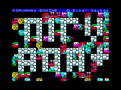

---
## UTILITIES

### +3e FileBrowser

Author: BCH

Type: Utility

Year: 2013

Source: Yes

Link: [http://www.boriel.com/forum/post4353.html#p4353](http://www.boriel.com/forum/post4353.html#p4353)

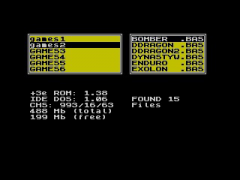

---
### Multi I/O Board

Author: Ian Johnston

Type: Utility

Year: 2014

Source: Yes

Link: [http://www.boriel.com/forum/gallery/show-off-your-creativity-t578-45.html#p5341](http://www.boriel.com/forum/gallery/show-off-your-creativity-t578-45.html#p5341)

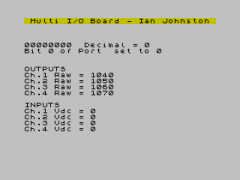

---
### The Spectrum Client

Author: ardentcrest

Type: Utility

Year: 2015

Source: No

Link: [https://www.boriel.com/forum/showthread.php?tid=644](https://www.boriel.com/forum/showthread.php?tid=644)

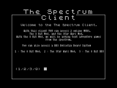

---
### ZX7

Author: Einar Saukas

Type: Utility

Year: 2012

Source: Yes

Link: [https://spectrumcomputing.co.uk/index.php?cat=96&id=27996](https://spectrumcomputing.co.uk/index.php?cat=96&id=27996)

---
## HARDWARE ADD-ONS

- [Spectra](released_programs_-_spectra.md)

---
## OTHER HARDWARE

### Home Computers

- Sinclair [ZX-Spectrum](released_programs.md) (default)

- ASCII [MSX](released_programs_-_msx.md)

- Mattel [Aquarius](released_programs_-_mattelaquarius.md)

- [ZX-Evolution/ATM-Turbo](released_programs_-_zxevolutionatmturbo.md)

- Amstrad [CPC](released_programs_-_amstradcpc.md)

- MGT [Sam Coupé](released_programs_-_samcoupe.md)

- CCE [MC-1000](released_programs_-_mc1000.md)

- Sinclair [ZX81](released_programs_-_zx81.md)

- Casio [PV-2000](released_programs_-_pv2000.md)

- Sharp [MZ-700](released_programs_-_mz700.md)

- Sord [M5](released_programs_-_sordm5.md)

- Tandy Radio Shack [TRS-80 Model I](released_programs_-_trs-80.md)

- Bandai [Gundam RX-78](released_programs_-_rx78.md)

- Philips/Radiola [VG5000](released_programs_-_vg5000.md)

- [Enterprise 64/128](released_programs_-_enterprise.md)

### Game Consoles

- Amstrad [GX4000](released_programs_-_amstradcpc.md)

- Bally [Astrocade](released_programs_-_ballyastrocade.md)

- Casio [PV-1000](released_programs_-_pv1000.md)

- Coleco [ColecoVision](released_programs_-_colecovision.md)

- Sega [SG1000](released_programs_-_sg1000.md)

- Sega [Master System](released_programs_-_sms.md)

### Handheld Consoles

- Sega [GameGear](released_programs_-_gamegear.md)

### Arcade Systems

- Ace [Sidewinder](released_programs_-_acesidewinder.md)

- Alphadenshi/Sega [Champion Baseball](released_programs_-_alphadenshisegachampionbaseball.md)

- Bally/Midway [Rampage](released_programs_-_ballymidwayrampage.md)

- Bally/Midway/Zilec [Blue Print](released_programs_-_ballymidwayzilecblueprint.md)

- Barko [One+Two](released_programs_-_barkooneplustwo.md)

- Bordun [Sky Lancer](released_programs_-_bordunskylancer.md)

- Capcom [1942](released_programs_-_capcom1942.md)

- Capcom [BlackTiger](released_programs_-_capcomblacktiger.md)

- Capcom [Higemaru](released_programs_-_capcomhigemaru.md)

- Capcom [Section-Z](released_programs_-_capcomsectionz.md)

- Capcom [Vulgus](released_programs_-_capcomvulgus.md)

- Chuo [Time Limit](released_programs_-_chuotimelimit.md)

- Crawl/Denshi [Dorachan](released_programs_-_crawldenshidorachan.md)

- Daehyun [Pipeline](released_programs_-_daehyunpipeline.md)

- Dyna [Royal Casino](released_programs_-_dynaroyalcasino.md)

- ElectronicDevices [Ping Pong Masters ’93](released_programs_-_electronicdevicespingpongmasters93.md)

- Enerdyne [American SpeedWay](released_programs_-_enerdyneamericanspeedway.md)

- Epos [Megadon](released_programs_-_eposmegadon.md)

- Funai/Gakken [Esh’s Aurunmilla](released_programs_-_funaigakkeneshsaurunmilla.md)

- Funai/Gakken [Interstellar Laser Fantasy](released_programs_-_funaigakkeninterstellarlaserfantasy.md)

- Hoei [Laser Base](released_programs_-_hoeilaserbase.md)

- InChang [Funny Bubble](released_programs_-_inchangfunnybubble.md)

- Invi [Egg Hunt](released_programs_-_inviegghunt.md)

- Irem [M52](released_programs_-_iremm52.md)

- Irem [M62](released_programs_-_iremm62.md)

- Irem/GDI [Oli-Boo-Chu](released_programs_-_iremgdioliboochu.md)

- Jackson [Flipper Jack](released_programs_-_jacksonflipperjack.md)

- Jaleco [D-Day](released_programs_-_jalecodday.md)

- Jaleco [Field Combat](released_programs_-_jalecofieldcombat.md)

- Jaleco [Moero Pro Yakyuu Homerun Kyousou](released_programs_-_jalecomoeroproyakyuuhomerunkyousou.md)

- Jaleco [Naughty Boy](released_programs_-_jaleconaughtyboy.md)

- Kaneko [Fast Freddie](released_programs_-_kanekofastfreddie.md)

- Kaneko [Fighting Roller](released_programs_-_kanekofightingroller.md)

- Kiwako [Mr. Jong](released_programs_-_kiwakomrjong.md)

- Komax [Flower](released_programs_-_komaxflower.md)

- Konami [Green Beret](released_programs_-_konamigreenberet.md)

- Konami [Mogura Desse](released_programs_-_konamimoguradesse.md)

- Konami [Ping Pong](released_programs_-_konamipingpong.md)

- Konami [Pooyan](released_programs_-_konamipooyan.md)

- Konami [Scramble](released_programs_-_scramble.md)

- Konami [Super Cobra](released_programs_-_konamisupercobra.md)

- Konami [Target Panic](released_programs_-_konamitargetpanic.md)

- Konami [Test Board](released_programs_-_konamitestboard.md)

- Konami [Time Pilot](released_programs_-_konamitimepilot.md)

- Meadows [WarpSpeed](released_programs_-_meadowswarpspeed.md)

- Mondial [LadyFrog](released_programs_-_mondialladyfrog.md)

- Namco [PacMan](released_programs_-_pacman.md)

- Nichibutsu [Gomoku Narabe Renju](released_programs_-_nichibutsugomokunaraberenju.md)

- Nichibutsu [Seicross](released_programs_-_nichibutsuseicross.md)

- Nintendo [Donkey Kong](released_programs_-_nintendodonkeykong.md)

- Olympia [D-Day](released_programs_-_olympiadday.md)

- Omori [Car Jamboree](released_programs_-_omoricarjamboree.md)

- Omori [Space Guerrilla](released_programs_-_omorispaceguerrilla.md)

- Orca [Funky Bee](released_programs_-_orcafunkybee.md)

- Orca [Marine Boy](released_programs_-_orcamarineboy.md)

- Orca [Zodiack](released_programs_-_orcazodiack.md)

- Orca/Thunderbolt [Espial](released_programs_-_orcathunderboltespial.md)

- PAL [Chance Thirty Two](released_programs_-_palchance32.md)

- Photon-IK2 [Brodjaga](released_programs_-_photonik2brodjaga.md)

- Poby [News](released_programs_-_pobynews.md)

- San Remo [Number One](released_programs_-_sanremonumberone.md)

- Sanritsu [Dr. Micro](released_programs_-_sanritsudrmicro.md)

- Sega [Appoooh](released_programs_-_segaappoooh.md)

- Sega [Bank Panic](released_programs_-_segabankpanic.md)

- Sega [Dottori Kun](released_programs_-_segadottorikun.md)

- Sega [E](released_programs_-_segae.md)

- Sega [Gigas](released_programs_-_segagigas.md)

- Seibu Kaihatsu [Knuckle Joe](released_programs_-_seibukaihatsuknucklejoe.md)

- Seibu Kaihatsu [Wiz](released_programs_-_seibukaihatsuwiz.md)

- Seoul Coin [Quiz Olympic](released_programs_-_seoulcoinquizolympic.md)

- Seta Kikaku [Hana Awase](released_programs_-_setakikakuhanaawase.md)

- Shoei [Sky Army](released_programs_-_shoeiskyarmy.md)

- Stern [Astro Invader](released_programs_-_sternastroinvader.md)

- Stern [Berzerk](released_programs_-_sternberzerk.md)

- Success/Fujiwara [Super Othello](released_programs_-_successfujiwarasuperothello.md)

- Summit Coin [Push Over](released_programs_-_summitcoinpushover.md)

- Sun [Dai San Wakusei Meteor](released_programs_-_sundaisanwakuseimeteor.md)

- Sun [Markham](released_programs_-_sunmarkham.md)

- Sun [Stratovox](released_programs_-_sunstratovox.md)

- Sun [StrenghtAndSkill](released_programs_-_sunstrenghtandskill.md)

- Taito [Chack'n'Pop](released_programs_-_taitochacknpop.md)

- Taito [Crazy Balloon](released_programs_-_taitocrazyballoon.md)

- Taito [Kusayakyuu](released_programs_-_taitokusayakyuu.md)

- Taito [Marine Date](released_programs_-_taitomarinedate.md)

- Taito [Metal Soldier Isaac II](released_programs_-_taitometalsoldierisaac2.md)

- Taito [Minivader](released_programs_-_taitominivader.md)

- Taito [Pit and Run](released_programs_-_taitopitandrun.md)

- Taito [Samurai Nihon Ichi](released_programs_-_taitosamurainihonichi.md)

- Taito [The Fairyland Story](released_programs_-_taitothefairylandstory.md)

- Taito [The Legend of Kage](released_programs_-_taitothelegendofkage.md)

- Taito [The Pit](released_programs_-_taitothepit.md)

- Taito [WyvernF0](released_programs_-_taitowyvernf0.md)

- Taiyo [ChineseHero](released_programs_-_taiyochinesehero.md)

- Tamtex [Shisensho Joshiryo Hen](released_programs_-_tamtexshisenshojoshiryohen.md)

- Tecfri [Sauro](released_programs_-_tecfrisauro.md)

- [Tecmo](released_programs_-_tecmo.md)

- Tecmo [Solomon’s Key](released_programs_-_tecmosolomonskey.md)

- Tehkan [Bomb Jack](released_programs_-_tehkanbombjack.md)

- Tehkan [Pinball Action](released_programs_-_tehkanpinballaction.md)

- Tehkan [Red Clash](released_programs_-_tehkanredclash.md)

- Teknon Kogyo [Beam Invader](released_programs_-_teknonkogyobeaminvader.md)

- Universal [Cheeky Mouse](released_programs_-_universalcheekymouse.md)

- Universal [Cosmic Alien](released_programs_-_universalcosmicalien.md)

- Universal [Do Castle](released_programs_-_universaldocastle.md)

- Universal [Lady Bug](released_programs_-_universalladybug.md)

- Universal [Mr. Do](released_programs_-_universalmrdo.md)

- Valadon [Bagman](released_programs_-_valadonbagman.md)

- Valadon [Tank Busters](released_programs_-_valadontankbusters.md)

- VEB [Poly-Play](released_programs_-_vebpolyplay.md)

- Wing [Super Wing](released_programs_-_wingsuperwing.md)

- Wonwoo [Domino Block](released_programs_-_wonwoodominoblock.md)

- Zaccaria [Jack Rabbit](released_programs_-_zaccariajackrabbit.md)

- Zilec [Enigma II](released_programs_-_zilecenigma2.md)

